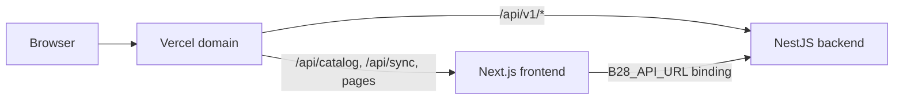

# Deploy B28 to Vercel (full stack)

Your repo: **https://github.com/Defininitelyapanda/b28-streamer**

This project uses **Vercel Services** — one deployment runs both the Next.js streaming site and the NestJS API on the same domain.

## Architecture



| Path | Service |
|------|---------|
| `/`, `/browse`, `/watch/*`, … | `frontend` (Next.js) |
| `/api/catalog`, `/api/sync` | `frontend` (Next.js API routes) |
| `/api/v1/*`, `/api/docs`, `/health` | `backend` (NestJS) |

Configuration lives in [vercel.json](vercel.json) at the **repo root** (not `frontend/`).

## Step 1 — Import on Vercel

1. Open **https://vercel.com/new**
2. Sign in with **GitHub** and import **`b28-streamer`**
3. In **Build and Deployment** settings, set **Framework Preset** to **Services**
4. Set **Root Directory** to **`.`** (repository root — leave blank or use `.`)
5. Do **not** set Root Directory to `frontend` — that was the old single-app setup
6. Click **Deploy**

Vercel reads [vercel.json](vercel.json):

```json
{
  "services": {
    "frontend": { "root": "frontend", "framework": "nextjs" },
    "backend": { "root": "backend", "framework": "nestjs" }
  },
  "rewrites": [
    { "source": "/api/v1/:path*", "destination": { "service": "backend" } },
    { "source": "/(.*)", "destination": { "service": "frontend" } }
  ]
}
```

> **Note on `/api/backend`:** Some Vercel templates use `/api/backend` as a proxy prefix. This API already exposes routes under `/api/v1`, so rewrites target `/api/v1/*` directly. The browser and server both call the same paths in production.

## Step 2 — Environment variables

**Project → Settings → Environment Variables**

Set for **Production**, **Preview**, and **Development**:

### Backend (required for auth, catalog sync, subscriptions)

| Key | Example / notes |
|-----|-----------------|
| `DATABASE_URL` | Postgres connection string ([Vercel Postgres](https://vercel.com/docs/storage/vercel-postgres) or [Neon](https://neon.tech)) |
| `JWT_ACCESS_SECRET` | Min 32 characters |
| `JWT_REFRESH_SECRET` | Min 32 characters |
| `NODE_ENV` | `production` |

### Backend (optional)

| Key | Notes |
|-----|-------|
| `REDIS_URL` | Upstash Redis or similar; health check tolerates missing Redis in production |
| `CORS_ORIGIN` | Defaults work when frontend and API share the same Vercel domain |
| `SWAGGER_ENABLED` | `true` to expose `/api/docs` |

### Frontend

| Key | Production value |
|-----|------------------|
| `NEXT_PUBLIC_API_URL` | `/api/v1` (same-origin; no `localhost`) |
| `YOUTUBE_API_KEY` | Optional — seeded catalog works without it |
| `YOUTUBE_CHANNEL_ID` | Optional |
| `CRON_SECRET` | Required for `/api/sync` cron in production |

`B28_API_URL` is injected automatically via the **service binding** in [vercel.json](vercel.json) so server-side catalog fetches reach the backend internally.

After adding variables, **Redeploy**.

## Step 3 — Database migrations

Run migrations against your production database once:

```powershell
cd backend
$env:DATABASE_URL="your-production-url"
npm run prisma:migrate:deploy
npm run prisma:seed
```

Or use Vercel CLI / a CI job with `DATABASE_URL` set.

## Step 4 — Verify live site

Replace `YOUR-APP` with your Vercel URL (e.g. `b28-streamer.vercel.app`):

- https://YOUR-APP.vercel.app/
- https://YOUR-APP.vercel.app/browse
- https://YOUR-APP.vercel.app/api/catalog
- https://YOUR-APP.vercel.app/api/v1/catalog
- https://YOUR-APP.vercel.app/health
- https://YOUR-APP.vercel.app/api/docs

## Step 5 — YouTube auto-sync (optional)

After `CRON_SECRET` is set:

```powershell
Invoke-WebRequest -Uri "https://YOUR-APP.vercel.app/api/sync" -Headers @{ Authorization = "Bearer YOUR_CRON_SECRET" }
```

Cron runs daily at midnight UTC (see `crons` in [vercel.json](vercel.json)).

## Deploy from CLI

```powershell
cd A:\b28
npx vercel login
npx vercel --prod
```

## Local development (unchanged)

```powershell
npm run start
```

Local dev still uses separate ports (`:3000`, `:4000`, `:4001`). Vercel Services routing applies only in deployed environments.

## Update after changes

```powershell
git add .
git commit -m "Your change"
git push
```

Vercel redeploys automatically on push to `main`.

## Not deployed on Vercel

The admin dashboard (`backend/dashboard/`, port `:3001` locally) is not part of this Vercel Services setup. Deploy it separately if needed.
