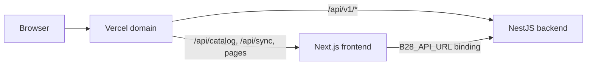

# Deploy B28 to Vercel (full stack)

Your repo: **https://github.com/Defininitelyapanda/b28-streamer**

This project uses **Vercel Services** — one deployment runs both the Next.js streaming site and the NestJS API on the same domain.

## Architecture



| Path | Service |
|------|---------|
| `/`, `/browse`, `/watch/*`, … | `frontend` (Next.js) |
| `/api/catalog`, `/api/sync` | `frontend` (Next.js API routes) |
| `/api/v1/*`, `/api/docs`, `/health` | `backend` (NestJS) |

> **Note:** Vercel Services does not support Next.js Edge middleware. Auth gates run in the Node.js `(protected)` layout instead of `middleware.ts`.

## Step 1 — Import on Vercel

1. Open **https://vercel.com/new**
2. Sign in with **GitHub** and import **`b28-streamer`**
3. In **Build and Deployment** settings, set **Framework Preset** to **Services**
4. Set **Root Directory** to **`.`** (repository root — leave blank or use `.`)
5. Do **not** set Root Directory to `frontend` — that was the old single-app setup
6. Click **Deploy**

Vercel reads [vercel.json](vercel.json):

```json
{
  "services": {
    "frontend": { "root": "frontend", "framework": "nextjs" },
    "backend": { "root": "backend", "framework": "nestjs" }
  },
  "rewrites": [
    { "source": "/api/v1/:path*", "destination": { "service": "backend" } },
    { "source": "/(.*)", "destination": { "service": "frontend" } }
  ]
}
```

> **Note on `/api/backend`:** Some Vercel templates use `/api/backend` as a proxy prefix. This API already exposes routes under `/api/v1`, so rewrites target `/api/v1/*` directly. The browser and server both call the same paths in production.

## Step 2 — Environment variables

**Project → Settings → Environment Variables**

Set for **Production**, **Preview**, and **Development**:

### Backend (required for auth, catalog sync, subscriptions)

| Key | Example / notes |
|-----|-----------------|
| `DATABASE_URL` | Postgres connection string ([Vercel Postgres](https://vercel.com/docs/storage/vercel-postgres) or [Neon](https://neon.tech)). **Production must use pooled connection** — append `?pgbouncer=true` or use Neon's pooled host. |
| `JWT_ACCESS_SECRET` | Min 32 characters |
| `AUTH_AUTO_VERIFY` | Set to `true` until `RESEND_API_KEY` is configured (otherwise new users cannot verify email) |
| `NODE_ENV` | `production` |

### Backend (optional)

| Key | Notes |
|-----|-------|
| `REDIS_URL` | Optional — health reports `redis: false` when unset; readiness only requires database |
| `GOOGLE_CLIENT_ID` | Required for Google sign-in (must match frontend `NEXT_PUBLIC_GOOGLE_CLIENT_ID`) |
| `YOUTUBE_API_KEY` | Required for server-side YouTube catalog sync |
| `YOUTUBE_CHANNEL_ID` | YouTube channel to sync into Postgres |
| `CRON_SECRET` | Validates internal YouTube sync cron requests |
| `RESEND_API_KEY` | Sends verification/reset emails in production (console fallback when unset) |
| `EMAIL_FROM` | Sender address for Resend |
| `CORS_ORIGIN` | Defaults work when frontend and API share the same Vercel domain |
| `SWAGGER_ENABLED` | `false` by default in production |

### Frontend

| Key | Production value |
|-----|------------------|
| `NEXT_PUBLIC_API_URL` | `/api/v1` (same-origin; no `localhost`) |
| `AUTH_SECRET` | **Required** — random 32+ char secret for NextAuth session encryption |
| `AUTH_URL` | `https://YOUR-APP.vercel.app` (your production site URL) |
| `GOOGLE_CLIENT_ID` | Same as backend — enables Google OAuth in NextAuth |
| `GOOGLE_CLIENT_SECRET` | Google OAuth client secret for NextAuth |
| `YOUTUBE_API_KEY` | Required for YouTube → Postgres sync |
| `YOUTUBE_CHANNEL_ID` | Required for YouTube sync |
| `CRON_SECRET` | Required for `/api/sync` cron in production |

### Cloudflare R2 (self-hosted playback)

| Key | Notes |
|-----|-------|
| `R2_ACCOUNT_ID` | Cloudflare account ID |
| `R2_ACCESS_KEY_ID` | R2 API token access key |
| `R2_SECRET_ACCESS_KEY` | R2 API token secret |
| `R2_BUCKET_NAME` | Bucket for film uploads |
| `R2_PUBLIC_DOMAIN` | Optional CDN domain for poster images |

### Admin dashboard (separate deploy)

| Key | Notes |
|-----|-------|
| `AUTH_SECRET` | Use a **different** value from frontend if both share a parent domain |
| `AUTH_URL` | Admin dashboard URL |
| `NEXT_PUBLIC_API_URL` | Backend API base (`/api/v1` or full URL) |

`B28_API_URL` is injected automatically via the **service binding** in [vercel.json](vercel.json) so server-side catalog fetches reach the backend internally.

After adding variables, **Redeploy**.

## Step 3 — Database migrations

Run migrations against your production database once:

```powershell
cd backend
$env:DATABASE_URL="your-production-url"
npm run prisma:migrate:deploy
npm run prisma:seed
```

The Vercel backend build also runs `prisma:seed-if-empty` automatically when `DATABASE_URL` is set (seeds roles/users only on an empty database).

## Step 4 — Verify live site

Replace `YOUR-APP` with your Vercel URL (e.g. `b28-streamer.vercel.app`):

- https://YOUR-APP.vercel.app/
- https://YOUR-APP.vercel.app/browse
- https://YOUR-APP.vercel.app/login (auth required for streaming)
- https://YOUR-APP.vercel.app/api/v1/catalog (public — no auth required)
- https://YOUR-APP.vercel.app/health
- https://YOUR-APP.vercel.app/api/docs

## Step 5 — YouTube auto-sync (optional)

After `CRON_SECRET` is set:

```powershell
Invoke-WebRequest -Uri "https://YOUR-APP.vercel.app/api/sync" -Headers @{ Authorization = "Bearer YOUR_CRON_SECRET" }
```

Cron runs daily at midnight UTC (see `crons` in [vercel.json](vercel.json)).

## Phase A verification (post-deploy checklist)

Run after each backend stabilization deploy. Replace `YOUR-APP` with your Vercel URL.

| Check | Command / URL | Expected |
|-------|---------------|----------|
| Health | `GET /health` | 200 |
| Ready | `GET /health/ready` | 200, `database: true` |
| Public catalog | `GET /api/v1/catalog` | 200, videos array, no auth |
| Offers | `GET /api/v1/subscriptions/offers` | 200 |
| Login | `POST /api/v1/auth/login` | 201 + tokens |
| Browse (logged out) | `/browse` | Shows DB catalog, not seed-only |
| Watch metadata | `/watch/[slug]` logged out | Poster/title from API |
| Streaming gated | `GET /api/v1/streaming/play/:slug` no auth | 401 |
| Dev bypass off | Confirm `DEV_BYPASS_STREAMING` unset in prod | — |
| Payment safety | `PREMIUM` and `payments.gateway_enabled` both **false** in DB | — |

```powershell
# Quick smoke script
$base = "https://YOUR-APP.vercel.app"
Invoke-WebRequest "$base/health"
Invoke-WebRequest "$base/health/ready"
Invoke-WebRequest "$base/api/v1/catalog"
Invoke-WebRequest "$base/api/v1/subscriptions/offers"
Invoke-WebRequest -Method POST "$base/api/v1/auth/login" -ContentType "application/json" -Body '{"email":"filmmaker@b28.dev","password":"Password123!"}'
```

## Deploy from CLI

```powershell
cd A:\b28
npx vercel login
npx vercel --prod
```

## Local development (unchanged)

```powershell
npm run start
```

Local dev still uses separate ports (`:3000`, `:4000`, `:4001`). Vercel Services routing applies only in deployed environments.

## Update after changes

```powershell
git add .
git commit -m "Your change"
git push
```

Vercel redeploys automatically on push to `main`.

## Not deployed on Vercel

The admin dashboard (`backend/dashboard/`, port `:3001` locally) is not part of this Vercel Services setup. Deploy it separately if needed.
